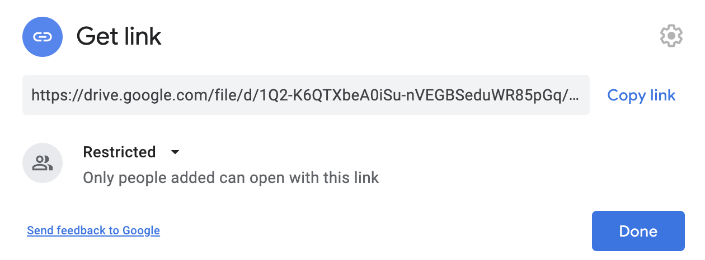
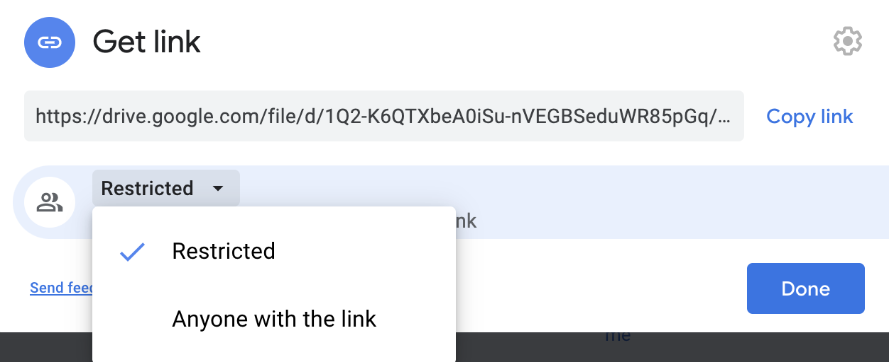
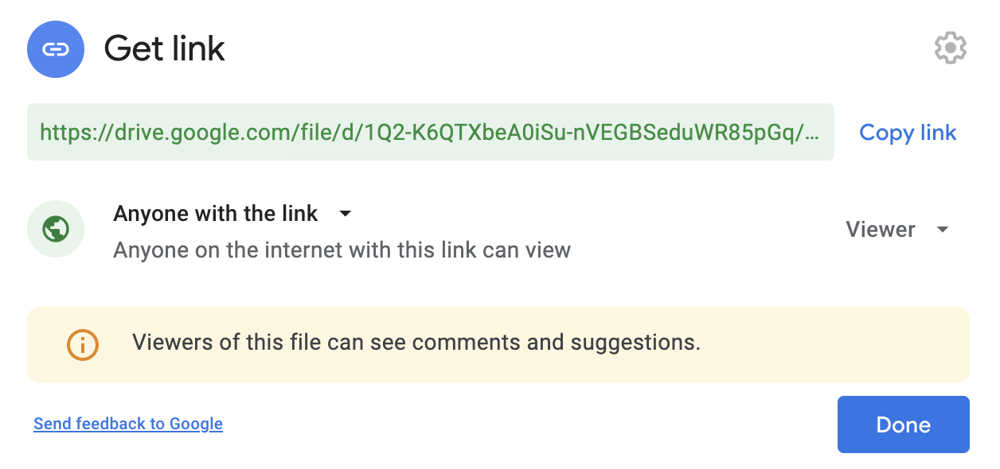

Follow these instructions to host an image in Google Drive and get a link that you can use to include that image for download in programs, web pages, etc.

--- task ---

Go to [drive.google.com](https://drive.google.com/) and drag an image from your computer to the drive. Wait for it to finish uploading.

--- /task ---

--- task ---

Once the image is in drive, right-click on it and choose 'Get shareable link'. 



--- /task ---

--- task ---

In the dialogue that opens, change who has permission to view the image from 'Restricted' to 'Anyone with the link'



--- /task ---

--- task ---

There should now be a link highlighted in the dialogue box.



In this link you can find the ID code for the file between `/d/` and `/view?usp=sharing`. It should look something like this:

```
1xunlhWWxA6e59gSL_gTo_CiZYBNqbMDy
```

Copy this ID.

--- /task ---

--- task ---

Use the ID you have just copied to complete this URL, inserting it in place of `[IMAGE ID]`:

```
https://drive.google.com/uc?export=download&id=[IMAGE ID]
```

You should get something like this:

```
https://drive.google.com/uc?export=download&id=1xunlhWWxA6e59gSL_gTo_CiZYBNqbMDy
```

This is the link you need to include in your code to allow the image to be downloaded.

--- /task ---